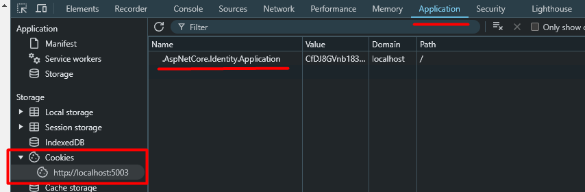

# How to Fetch Data from a REST API with Authentication

## Example using Swagger

### 1. Send an HTTP POST request to the `/register` endpoint
* Replace "string" with your email and password (use a dummy one, please)

```json
{
    "email": "alice@demo.com",
    "password": "Pass123!"
}
```
Check if you get a 200 code response.

### 2. Send an HTTP POST request to the `/login` endpoint
* If possible, enable `useCookies` (depends on your browser or application)
* Do not set anything for `useSessionCookies`
* Inside the body, set up the email and password like this:

```json
{
    "email": "alice@demo.com",
    "password": "Pass123!"
}
```

Equivalent curl command:
```bash
curl -X 'POST' \
'http://localhost:5003/login?useCookies=true' \
-H 'accept: application/json' \
-H 'Content-Type: application/json' \
-d '{
    "email": "alice@demo.com",
    "password": "Pass123!"
}'
```

### 3. Send your typical request, such as an HTTP GET request to `/WeatherForecast`

### 4. Delete cookie (Force manual logout)

Simply delete the identity cookie (F12 on your browser)


> Note: You can have more information [here](https://learn.microsoft.com/en-us/aspnet/core/security/authentication/identity-api-authorization?view=aspnetcore-9.0#the-mapidentityapituser-endpoints)
